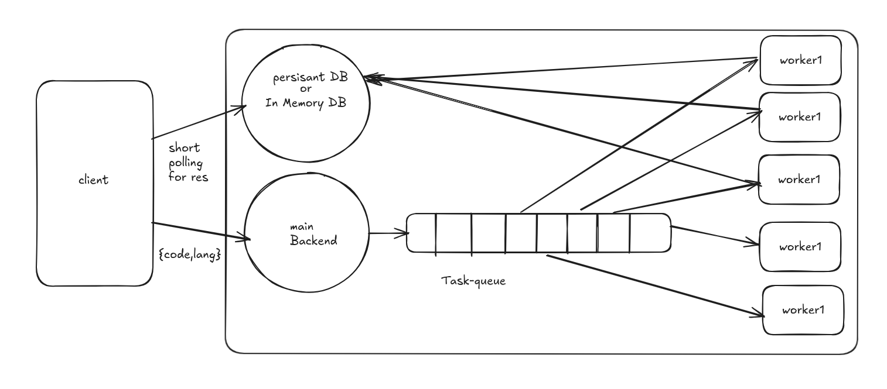

# 🚀 CodeBlaster_3000 - Remote Code Execution Engine

## 🛠️ Tech Stack
- **Node.js** - Backend API & Worker
- **Docker** - Containerization
- **Redis** - Message Broker
- **BullMQ** - Message Queue for job processing

---

## 📜 Architecture



---

## ⚡ Installation

1. **Clone the Repository**
   ```sh
   git clone https://github.com/vr-varad/CodeBlaster_3000.git
   cd CodeBlaster_3000
   ```

2. **Start Services with Docker Compose**
   ```sh
   docker compose up -d
   ```

   This starts 4 services:
   - `code_blaster_3000_server` - API server (Port: `3000`)
   - `code_blaster_3000_worker` - Worker for code execution & result storage
   - `code_blaster_3000_redis` - Redis as the message broker
   - `code_blaster_3000_mongo` - MongoDB for storing results

---

## 🚀 Usage

### 1️⃣ Submit Code
Submit code for execution by making a `POST` request to `/submit`.

**Request Body:**
```json
{
    "code": "print(1)",
    "language": "python"
}
```

**Response:**
```json
{
    "status": "success",
    "jobId": "123456"
}
```

### 2️⃣ Fetch Execution Result
Retrieve the execution result by making a `GET` request to `/result`.

**Request Body:**
```json
{
    "jobId": "123456"
}
```

**Response Example:**
```json
{
    "status": "completed",
    "output": "1",
    "jobId": "123456"
}
```

---

